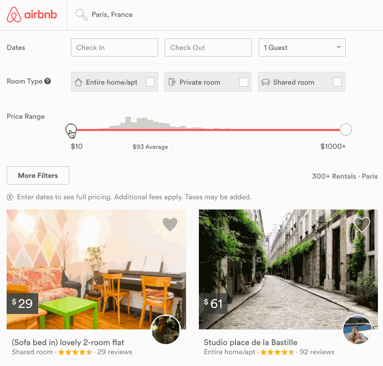

# Rheostat

> A mobile, tablet, desktop, and accessible slider for the web.



## Install

`npm install rheostat`

## Initialize

As of v3.0.0, the `rheostat` project relies on `react-with-styles`. If you want to continue using CSS stylesheets and classes, there is a little bit of extra set-up required to get things going. As such, you need to use to use `rheostat/initialize` to set up class names on your components.

    import 'rheostat/initialize';

For example, the above import should go at the top of your application as you won't be able to import `rheostat` with it.

## Props

The algorithm, by default [`linear`](src/algorithms/linear.js), the slider will use. Feel free to write
your own as long as it conforms to the shape.

```js
  algorithm: PropTypes.shape({
    getValue: PropTypes.func,
    getPosition: PropTypes.func,
  })
```

Custom class name that will be applied to the root of Rheostat.

```js
  className: PropTypes.string
```

Custom React component overrides for the handles, background, and the "progress" bar.

```js
  background: PropTypes.oneOfType([PropTypes.func, PropTypes.string])
  handle: PropTypes.oneOfType([PropTypes.func, PropTypes.string])
  progressBar: PropTypes.oneOfType([PropTypes.func, PropTypes.string])
```

The maximum and minimum possible values, by default 0 - 100.

```js
  max: PropTypes.number
  min: PropTypes.number
```

`pitComponent` is a custom React component for rendering "pits" across the bar.
`pitPoints` is the set of points at which it will render a pit. Points are an array
of `values` on the slider.

```js
  pitComponent: PropTypes.oneOfType([PropTypes.func, PropTypes.string])
  pitPoints: PropTypes.arrayOf(PropTypes.number)
```

NOTE: `onChange` is called whenever the value is changed and committed. This happens at the end of
a drag, keypress, or click event. `onChange` is recommended when you wish to persist the values.

`onValuesUpdated` is a convenience event that is triggered while the value is being actively
changed. This includes dragging, click, or keypress. `onValuesUpdated` is recommended if you need
to work with the values before they're committed.

If you need to perform custom logic to postprocess the handle position, `getNextHandlePosition` accepts
a callback of the form `(handleIdx: int, percentPosition: float) => float`. Return the updated
handle position. This is useful if you need to customize ranges within a single slider.

```js
  onChange: PropTypes.func
  onClick: PropTypes.func
  onKeyPress: PropTypes.func
  onSliderDragEnd: PropTypes.func
  onSliderDragMove: PropTypes.func
  onSliderDragStart: PropTypes.func
  onValuesUpdated: PropTypes.func
  getNextHandlePosition: PropTypes.func
```

`snap` is a boolean which controls the slider's snapping behavior.
`snapPoints` is an array of `values` on the slider where the slider should snap to.

If `snap` is set to true and no `snapPoints` are set then the slider is snapped into an absolute
position. For example, on a scale of 1-10 if the slider is let go at the 54% mark it'll pick the
value 5 and snap to 50%.

```js
  snap: PropTypes.bool
  snapPoints: PropTypes.arrayOf(PropTypes.number)
```

The values, by default 0 and 100.

```js
  values: PropTypes.arrayOf(PropTypes.number)
```

You can disable the slider to prevent the user from moving it.

```js
  disabled: PropTypes.bool
```

## Usage

> Important: Make sure to include the [css file](https://unpkg.com/rheostat@3/css/rheostat.css) or feel free to create your own.

* Simple.

```js
import Rheostat from 'rheostat';

ReactDOM.render(<Rheostat />, document.getElementById('slider-root'));
```

* A slider with a multiple handles.

```js
import Rheostat from 'rheostat';

ReactDOM.render((
  <Rheostat
    min={1}
    max={100}
    values={[1, 100]}
  />
), document.getElementById('slider-root'));
```

### Advanced Styling

The `rheostat/initialize` script actually relies on [react-with-styles-interface-css](https://github.com/airbnb/react-with-styles-interface-css) under the hood. If you are interested in a different solution for styling in your project, you can do your own initialization of a another [interface](https://github.com/airbnb/react-with-styles/blob/master/README.md#interfaces). At Airbnb, for instance, we rely on [Aphrodite](https://github.com/Khan/aphrodite) under the hood and therefore use the Aphrodite interface for `react-with-styles`. If you want to do the same, you would use the following pattern:
```js
import ThemedStyleSheet from 'react-with-styles/lib/ThemedStyleSheet';
import aphroditeInterface from 'react-with-styles-interface-aphrodite';
import DefaultTheme from 'rheostat/lib/themes/DefaultTheme';

ThemedStyleSheet.registerInterface(aphroditeInterface);
ThemedStyleSheet.registerTheme(DefaultTheme);
```

The above code has to be run before any `rheostat` component is imported. Otherwise, you will get an error. Also note that if you register any custom interface manually, you *must* also manually register a theme.

### Theming
`rheostat` also now supports a different way to theme. You can see the default theme values in [this file](https://github.com/airbnb/rheostat/blob/master/src/themes/DefaultTheme.js) and you would override them in the following manner:
```js
import ThemedStyleSheet from 'react-with-styles/lib/ThemedStyleSheet';
import aphroditeInterface from 'react-with-styles-interface-aphrodite';
import DefaultTheme from 'rheostat/lib/themes/DefaultTheme';

ThemedStyleSheet.registerInterface(aphroditeInterface);
ThemedStyleSheet.registerTheme({
  rheostat: {
    ...DefaultTheme.rheostat,
    color: {
      ...DefaultTheme.rheostat.color,
      progressBar: 'red',
    },
  },
});
```

The above code would make the default progress bar red, instead of light blue. Note that you *must* register an interface if you manually register a theme. One will not work without the other.

#### A note on using `react-with-styles-interface-css`
The default interface that `rheostat` ships with is the [CSS interface](https://github.com/airbnb/react-with-styles-interface-css). If you want to use this interface along with the theme registration method, you will need to rebuild the core `rheostat.css` file. We do not currently expose a utility method to build this file, but you can follow along with the code in https://github.com/airbnb/rheostat/blob/master/scripts/buildCSS.js to build your own custom themed CSS file.

### RTL Support

`rheostat` now supports automatic RTL rendering through [`react-with-direction`](https://github.com/airbnb/react-with-direction).

## Live Playground

For more examples you can check out the storybook.

* Clone this repo on your machine.
* `npm install`
* `npm run storybook`
* Visit `http://localhost:9001/`.
